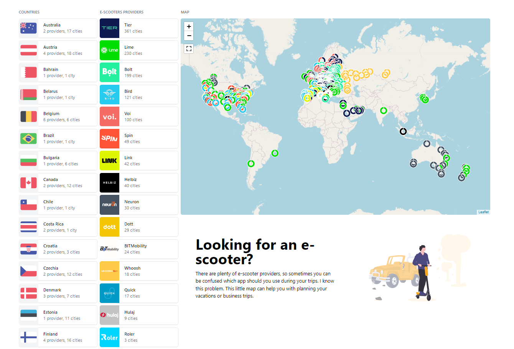

## Escooters

### Ideas to consider
- restrict max zoom out to avoid looped empty map view
- city search bar to find and pin location on a map - user would've been able to check e-scooters nearby
- selection bar for countries or sth like map stick to viewport, now the list is definitely too long
- e-scooters providers seen as square logo buttons - more info (like number of cities, link to website) seen on click
- price comparison

### Last build
```
Cached cities loaded.
Build date: 2023-03-21 13:01:56

3 cities fetched for Roler.
9 cities fetched for Hulaj.
24 cities fetched for BITMobility.
199 cities fetched for Bolt.
230 cities fetched for Lime.
27 cities fetched for Quick.
360 cities fetched for Tier.
100 cities fetched for Voi.
42 cities fetched for Link.
49 cities fetched for Spin.
29 cities fetched for Neuron.
40 cities fetched for Helbiz.
18 cities fetched for Whoosh.
121 cities fetched for Bird.
29 cities fetched for Dott.

847 cities fetched.
```

### Available providers

| No. | Provider | Data source                                  |
|---|-----|----------------------------------------------|
| 1 | Lime | webscrapped                                  |
| 2 | Bolt | web API                                      |
| 3 | Tier | webscrapped                                  |
| 4 | Bird | webscrapped with partially estimated countries |
| 5 | Voi | webscrapped                                  |
| 6 | Spin | webscrapped                                  |
| 7 | Link| webscrapped                                  |
| 8 | Dott | webscrapped                                  |
| 9 | Quick | webscrapped                                  |
| 10 | Neuron | partially webscrapped                        |
| 11 | Whoosh | hardcoded                                    |
| 12 | Helbiz | hardcoded                                    |
| 13 | BIT Mobility | webscrapped                                  |
| 14 | Hulaj | webscrapped                                  |
| 15 | Roler | hardcoded                                    |

```
copy .env.example .env
docker-compose run --rm -u "$(id -u):$(id -g)" php composer install
docker-compose run --rm -u "$(id -u):$(id -g)" php php index.php
```